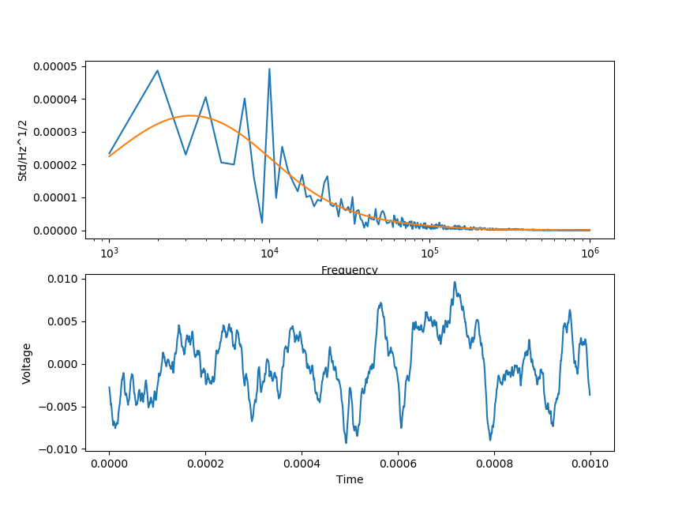

# Electrical Noise Generator

This project is a simple C++ program that allows to transform the noise spectral densities from a comma separated file, csv (or any char separated file), created from SPICE simulations (for example, LTSpice) to a voltage-time csv.

It was created with the purpose of simulating signals from any type of source (from electronics, or any type of noise spectra densities) for the analysis and prediction of experiments or products. 

## How to Install
In this git everything is available to compile the code with no additional libraries. Using an example noise spectral density (NSD) found in `Noise Spectras` called `noiseSpectra.csv` it is possible to test the software right away.

To compile you can run on Linux:
```bash
mkdir bin
cd bin
cmake ../
make
```

On Windows, you'll need to install CMake and MinGW then run the CMD on the folder:
```bash
mkdir bin
cd bin
cmake -G "MinGW Makefiles" ../ 
mingw32-make.exe
```
Make sure MinGW is in the PATH variable.

There is only one prerequisite: if using on Linux and OpenMP, it is required that the GNU GCC compiler version to be great than 6.0. Otherwise, the conflicting `#pragma` can be removed and it will compile. 

## Usage
To run the program just type in the console:

    NOISEGEN -o [OUTPUT_PATH] -i [INPUT_PATH]

If no OUTPUT_PATH and INPUT_PATH were included, it will try to use the default NSD found in `Noise Spectras` and it will output a csv file named `noise-example.csv` where the executable is located.

## Three different modes:
There are three different modes that you can use that depend on your needs: Fast, Precision, and mixed.

# Fast.
It uses look-up tables to calculate the sinewave to avoid using the sine function for all values. It works by, first, calculating the sinewave values for a complete period and saves it to an array, then it just adds those values to the time array by looping trough the table. The pseudo code can be seen here:
```c++
	void fastSine(double* arr, double w, double phase, double totalTime):
		double* sineTable = new double[2pi/w];
		for(i=0; i< 2pi/w; i++)
			sineTable[i] = sine((w*i)+phase);

		fpr(i=0; i<totalTime; i++)
			arr[i] = sineTable[i% (2pi/w)];

``` 
For the complete code look at `ListMath.cpp`.

There is another approximation and that is by filtering amplitudes which are too small relative to the maximum amplitude. For example, if the amplitud is `-60dB` smaller relative to the maximum value, it will be ignored and we will jump to the next frrequency. This is useful when dealing with NSD which peak at some value, and then quickly decade. 

In order to use the fast method, uncomment `std::unique_ptr<List2D> waveForm ( Generator.GenNoiseWaveFormSpeed() );` in `line 43` in `debug_main.cpp`, and comment the rest.

# Precision
There is no filtering and no approximations. This is the default uncommented line in the code.

# Mixed
Combines both methods. You can set to which frequencies the look-up sine wave table method will execute instead of doing that for all frequencies, and set the minimum amplitude filtering in dB relative to the maximum value. In order to use the fast method, uncomment `std::unique_ptr<List2D> waveForm ( Generator.GenNoiseWaveForm(-80) );` in `line 421` in `debug_main.cpp`, and comment the rest. You can change the -80 to any negative dB value you want, and you can include an optional argument for the frequency look-up table approach.

## Test the output

There is an included python script, `Compare.py`, that reads the output voltage-time file, and the NSD and output the variance for both files. It will also estimate the NSD from the voltage-time file and graph it along side the original NSD. Finally, it also plots the voltage-time signal.

It requires `pandas`, `matplotlib`, and `numpy` to work.

Example of a graph output from the script:


## Speed and precision test
It was necessary to know how precise and fast each mode was. For that, we created a program that runs 100 samples, calculates the mean, standard deviation, and corresponding errors. Also, we measured the time it took for the program to run. The table below shows these values. The errors were calculated assuming that there is a 99% probability of finding the true value.

Type | Mean (micro-volts) | Standard Deviation (milli-volts) | Time (seconds)
---|---|---|--- 
Precision 	| 3.73 +- 57 | 3.46 +- 0.56 | 1265 
Fast 		| 44.6 +- 53.8 | 3.26 +- 0.52  | 95
Mixed 		| -15.8 +- 57.2 |  3.47 +- 0.56 | 440
Real 		| 0.0	| 3.4681 | N/A


## Errors in the simulation

The simulation uses a sinewave table method, if used with the fast or mixed approach, which includes some errors which can be significant (higher than 1%) because of some non-linearities created from the sine wave table imperfections (it does not start where it ends). However, this is a good precision sacrifice as it can reduce the simulation time by 10. If you require very precise simulation, use the precise functions instead.


## TODO:

* Read and write to SQL/NoSQL databases.
* Optimize (use OpenCL, perhaps?)
* Started writting some statistical functions in ListStatistics so in the future it would be possible to only use the python script to plot.
* Add a feature to read from noise power spectras or noise spectras.
